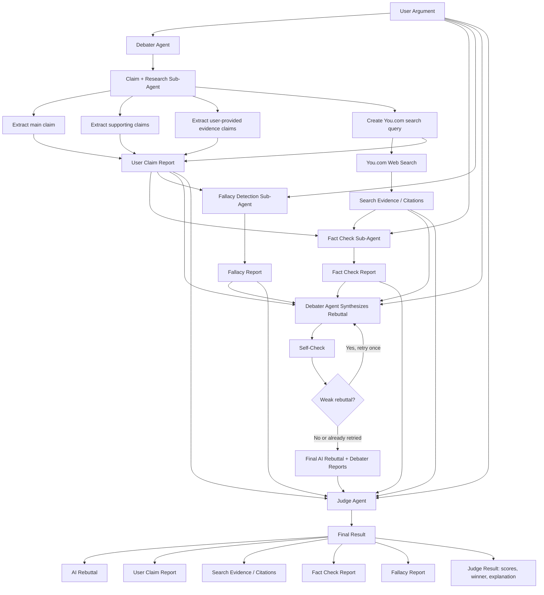

# Evidence-Grounded Agent Workflow

This document describes the local TypeScript agent workflow in `agent-workflow/`.
It is separate from the deployed `functions/judge-claim` edge function, but uses the
same core idea: debate decisions should be grounded in independent You.com evidence.

## Overview

The workflow has two main agents:

- **Debater Agent**: coordinates sub-agents and writes the final AI rebuttal.
- **Judge Agent**: scores the original user argument against the AI rebuttal.

The Debater Agent has three sub-agents:

- **Claim + Research Sub-Agent**: extracts claims, identifies user-provided evidence claims, creates a You.com query, and gathers citations.
- **Fact Check Sub-Agent**: checks the original user argument against the independent citations.
- **Fallacy Detection Sub-Agent**: analyzes the reasoning quality of the original user argument.

The workflow keeps fact checking and fallacy detection parallel after research evidence is available.

## Flow



## Responsibilities

### Claim + Research Sub-Agent

Input:

```ts
{
  user_argument: string;
  history?: DebateHistoryEntry[];
}
```

Responsibilities:

- Extract the user's main claim.
- Extract supporting claims.
- Extract user-provided evidence claims, such as alleged admissions, quotes, studies, statistics, or source claims.
- Create one concise You.com search query.
- Call You.com once for fast live-demo performance.
- Return the claim report and search evidence.

It does not produce final factual verdicts. It finds what needs checking and gathers independent evidence.

### Fact Check Sub-Agent

Input:

```ts
{
  user_argument: string;
  user_claim_report: UserClaimReport;
  search_evidence: SearchEvidence;
}
```

Responsibilities:

- Check the original user argument.
- Check the extracted main claim, supporting claims, and user-provided evidence claims.
- Compare those claims against independent You.com citations.
- Return true, false, mixed, or unsupported verdicts.

The fact checker should not use model memory as the final source of truth when citations are provided.

### Fallacy Detection Sub-Agent

Input:

```ts
{
  user_argument: string;
  user_claim_report: UserClaimReport;
}
```

Responsibilities:

- Analyze reasoning quality.
- Detect fallacies, unsupported leaps, ambiguity, or overgeneralization.
- Return a logic report.

This sub-agent does not perform factual verification.

### Debater Agent

Input:

```ts
{
  user_argument: string;
  difficulty?: Difficulty;
  history?: DebateHistoryEntry[];
}
```

Responsibilities:

- Run Claim + Research first.
- Run Fact Check and Fallacy Detection in parallel with `Promise.all`.
- Synthesize the final AI rebuttal using:
  - original user argument
  - claim report
  - search evidence
  - fact check report
  - fallacy report
- Run a local self-check.
- Retry synthesis once only if the rebuttal is weak.

### Judge Agent

Input:

```ts
{
  user_argument: string;
  ai_rebuttal: string;
  user_claim_report: UserClaimReport;
  search_evidence: SearchEvidence;
  fact_check_report: FactCheckReport;
  fallacy_report: FallacyReport;
}
```

Responsibilities:

- Score the user argument and AI rebuttal fairly.
- Reuse the Debater reports and You.com evidence.
- Decide `user`, `ai`, or `tie`.
- Explain the result.
- Never generate a new rebuttal.

## Core Data Contracts

```ts
interface Citation {
  title: string;
  url: string;
  snippet: string;
}

interface SearchEvidence {
  query: string;
  citations: Citation[];
}

interface UserClaimReport {
  main_claim: string;
  supporting_claims: string[];
  user_provided_evidence_claims: string[];
  search_query: string;
  context_summary: string;
  possible_weak_points: string[];
  useful_evidence: string[];
}

interface FactCheckReport {
  checked_claims: {
    claim: string;
    verdict: "true" | "false" | "mixed" | "unsupported";
    explanation: string;
  }[];
  overall_reliability: "high" | "medium" | "low";
  citations: Citation[];
}
```

The public workflow entrypoint remains:

```ts
runAgentWorkflow(input: { user_argument: string, difficulty?: Difficulty, history?: DebateHistoryEntry[] }): Promise<AgentWorkflowResult>
```

The result includes:

- `ai_rebuttal`
- `user_claim_report`
- `search_evidence`
- `fact_check_report`
- `fallacy_report`
- `debater_result`
- `judge_result`

## Local Smoke Test

Required environment variables:

```bash
INSFORGE_API_URL=
INSFORGE_API_KEY=
YOUCOM_API_KEY=
YOUCOM_SEARCH_URL=https://ydc-index.io/v1/search
SEARCH_COUNT=6
```

Run:

```bash
./scripts/test-agent-workflow.sh "The moon landing was fake because NASA admitted the footage was staged."
```

Expected output should include:

- `user_claim_report.main_claim`
- `user_claim_report.supporting_claims`
- `user_claim_report.user_provided_evidence_claims`
- `user_claim_report.search_query`
- `search_evidence.citations`
- `fact_check_report.checked_claims`
- `fact_check_report.citations`
- `fallacy_report`
- `ai_rebuttal`
- `judge_result`
